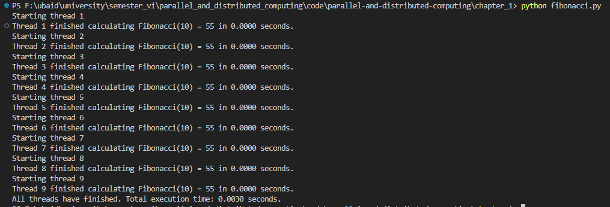
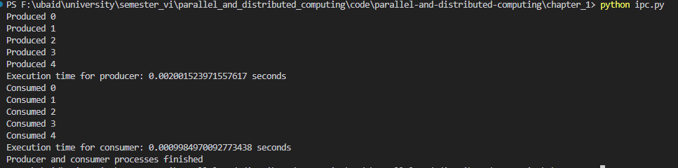
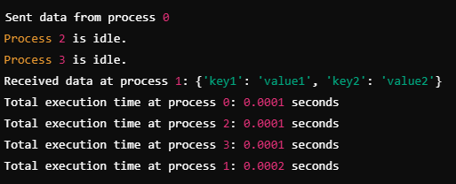
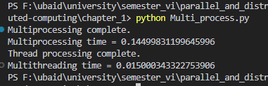
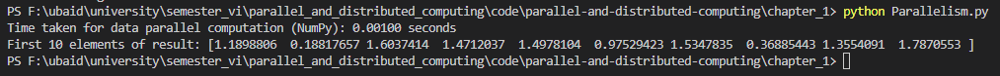
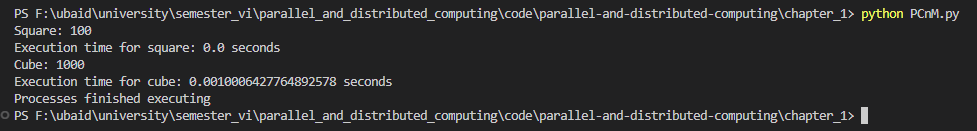
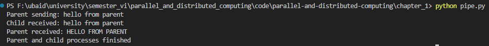
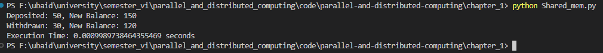
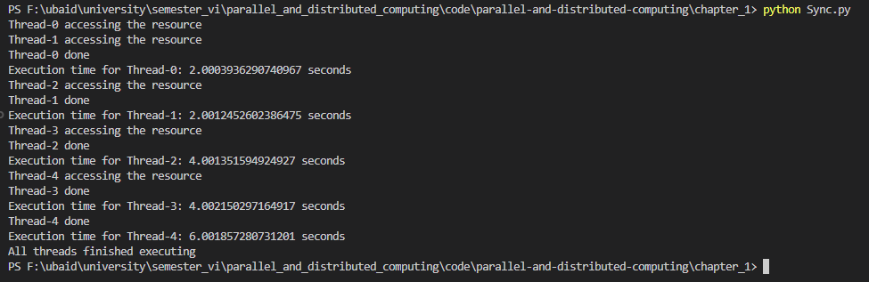

# Chapter 1

Parallel & Distributed Computing Chapter 1 code

## 1. Fibonacci Output

## 2. IPC Output

## 3. MPI Output

## 4. Multiprocess Output

## 5. Parallelism Output

## 6. PCnM Output

## 7. Pipe Output

## 8. Shared Memory Output

## 9. Sync Output

## 10. Task Parallelism Output

