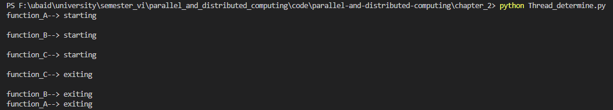
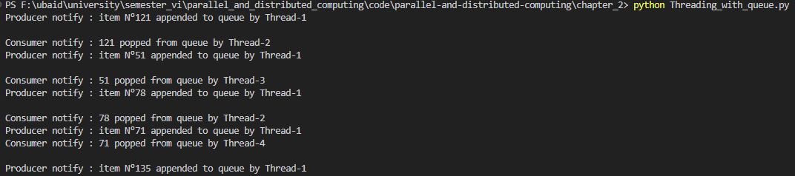

# Chapter 2

Parallel & Distributed Computing Chapter 2 code

## 1. Barrier Output

## 2. Condition Output

## 3. Event Output

## 4. MyThreadClass Lock 2 Output

## 5. MyThreadClass Lock Output

## 6. Rlock Output

## 7. Semaphore Output

## 8. Thread Definition Output

## 9. Thread Determine Output

## 10. Thread name and processes Output

## 11. Threading with queue

