# Chapter 3

Parallel & Distributed Computing Chapter 3 code

## 1. Communicating with Pipe Output
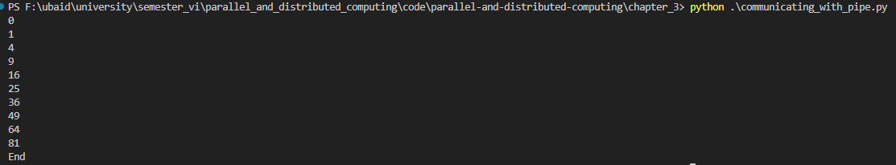

## 2. Communicating with queue Output
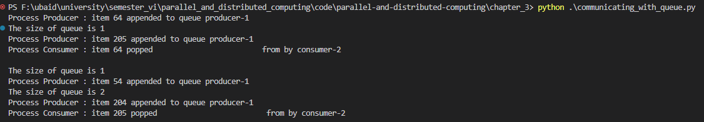

## 3. Derom Output
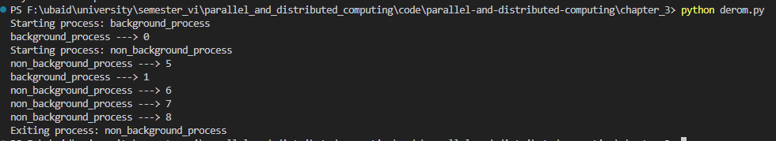

## 4. Killing Process Output
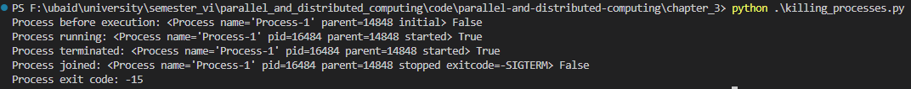

## 5. Naming Process Output
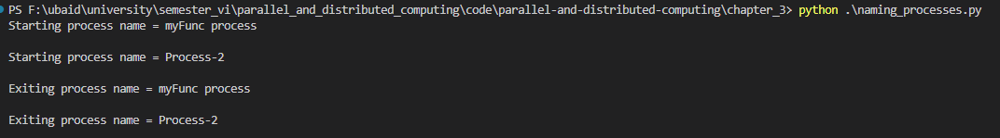

## 6. Process In Subclass Output
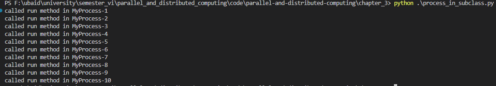

## 7. Process Pool Output
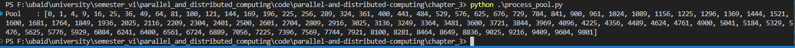

## 8. Process Barrier Output
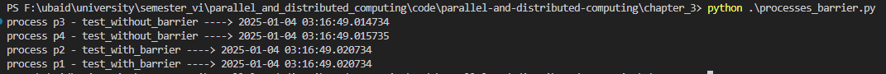

## 9. Run Background Process No Daemon Output
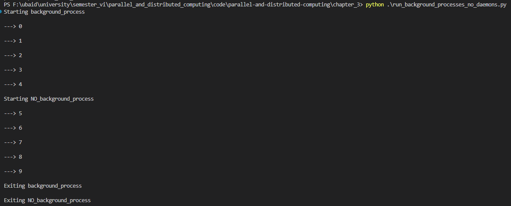

## 10. Run Background Process Output
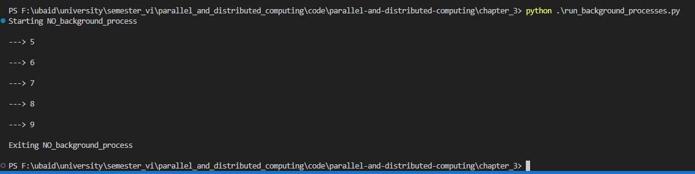

## 11. Spawning Process Namespace queue
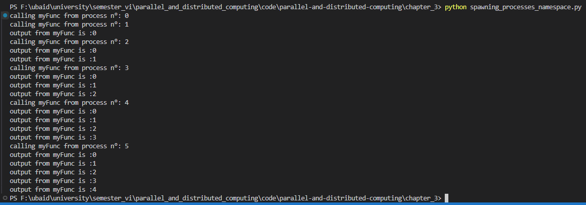

## 12. Spawning Process queue
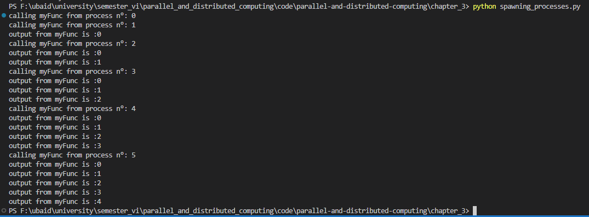
